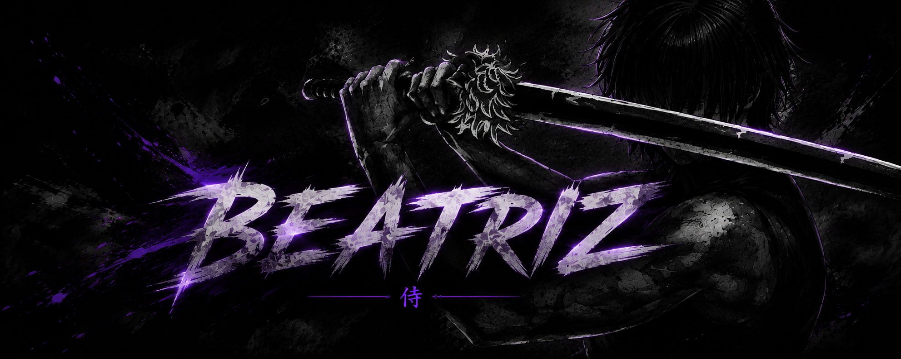

<div align="center">
  
</div>

<br/>
<!-- ===================================================== -->
<!--              BEATRIZ // SYSTEM INTERFACE              -->
<!-- ===================================================== -->

<br/>

<div align="center">


<br/><br/>


</div>

<br/>

---
## `> SYSTEM IDENTITY`

```yaml
USER:        Beatriz
ROLE:        Software Developer
LOCATION:    Brazil 🇧🇷
STATUS:      ONLINE

FOCUS:
  ├── FiveM Script Development
  ├── Web Development
  ├── Automation
  ├── Artificial Intelligence
  └── Systems Development

STACK:
  ├── Lua
  ├── JavaScript / TypeScript
  ├── Python
  └── Web Technologies
```

<div align="center">

`FIVEM DEVELOPMENT` • `SOFTWARE ENGINEERING` • `AUTOMATION` • `WEB SYSTEMS`


<h3 align="center">
  Transformando ideias em código, sistemas e experiências digitais.
</h3>

<br/>

<br/>

<div align="center">
  
</div>

<br/>

---

## `> TECH STACK`

<div align="center">

### `LANGUAGES`


<br/><br/>

### `FRONTEND`


<br/><br/>

### `BACKEND & DATABASE`


<br/><br/>

### `DEVELOPMENT TOOLS`


</div>

<br/>

---

---

<div align="left">

## `> FIVEM DEVELOPMENT`

<div align="center">


</div>

<br/>

<div align="left">

```lua
local FiveM = {
    developer = "Beatriz",
    status = "ACTIVE",

    building = {
        "Custom Scripts",
        "Server Systems",
        "NUI Interfaces",
        "Optimized Resources"
    },

    stack = {
        "Lua",
        "JavaScript",
        "HTML",
        "CSS"
    }
}

FiveM:build()
```

</div>

<div align="center">

`CUSTOM SCRIPTS` • `SERVER SYSTEMS` • `NUI` • `OPTIMIZATION`

</div>

<br/>

</div>

---


## `> DEV.TOOLS`

<div align="center">


</div>

<br/>

---
## `> PROJECTS`

<table>
<tr>

<td width="50%" valign="top">

### 🎮 FiveM Development

**Scripts • Systems • Resources**

Desenvolvimento de scripts e sistemas personalizados para servidores FiveM, incluindo recursos, interfaces e sistemas para diferentes aplicações dentro do servidor.

<br/>

`Lua` `JavaScript` `FiveM` `NUI`

<br/><br/>

<a href="https://github.com/biaymh?tab=repositories">

</a>

</td>

<td width="50%" valign="top">

### ⚡ Lipe Optimizer

**Performance • Software • Systems**

Desenvolvimento de soluções voltadas para performance, otimização de computadores e ferramentas para o ecossistema Lipe Optimizer.

<br/>

`Performance` `Software` `Windows` `Development`

<br/><br/>

<a href="https://github.com/biaymh?tab=repositories">

</a>

</td>

</tr>

<tr>

<td width="50%" valign="top">

### 💻 Web Development

**Applications • Interfaces • Platforms**

Desenvolvimento de aplicações e interfaces modernas, trabalhando com frontend, backend e integração de serviços.

<br/>

`React` `Next.js` `TypeScript` `Node.js`

<br/><br/>

<a href="https://github.com/biaymh?tab=repositories">

</a>

</td>

<td width="50%" valign="top">

### ⚙️ Systems & Automation

**Tools • Integrations • Workflows**

Desenvolvimento de ferramentas, integrações e automações para simplificar processos e conectar diferentes sistemas.

<br/>

`Python` `JavaScript` `APIs` `Automation`

<br/><br/>

<a href="https://github.com/biaymh?tab=repositories">

</a>

</td>

</tr>
</table>

<br/>

---

<div align="left">

## `> CURRENT.ACTIVITY`

```console
$ dev --status

ACTIVE PROJECTS
├── FiveM Resources
│   └── Developing scripts, systems and custom mechanics
│
├── Lipe Optimizer
│   └── Building performance tools and software
│
└── Web Projects
    └── Developing applications, interfaces and platforms


$ workflow --status

CODE ...................... RUNNING
PROJECTS .................. IN DEVELOPMENT
COMMITS ................... SHIPPING
BUGS ...................... BEING HUNTED
NEW IDEAS ................. LOADING...


$ next

> Build.
> Test.
> Improve.
> Ship.

SYSTEM STATUS: ONLINE █
```

</div>

<br/>

---

## `> GITHUB STATS`

<div align="center">


<br/><br/>


</div>

<br/>

---


## `> CONTRIBUTIONS`

<div align="center">

<picture>
  <source media="(prefers-color-scheme: dark)" srcset="https://raw.githubusercontent.com/biaymh/biaymh/gh-pages/github-contribution-grid-snake-dark.svg">
  <source media="(prefers-color-scheme: light)" srcset="https://raw.githubusercontent.com/biaymh/biaymh/gh-pages/github-contribution-grid-snake.svg">
  
</picture>

</div>

<br/>

---
## `> CONNECT`

<div align="center">

<p>
  <a href="https://www.linkedin.com/" target="_blank">
    
  </a>

  <a href="https://www.instagram.com/" target="_blank">
    
  </a>

  <a href="mailto:SEU_EMAIL">
    
  </a>

  <a href="https://github.com/biaymh" target="_blank">
    
  </a>
</p>

<br/>

<sub>Open to connections, collaborations and interesting projects.</sub>

</div>

<br/>

---

---

<div align="center">

```text
┌───────────────────────────────────────────────────────────────┐
│                                                               │
│        "THE FUTURE ISN'T PREDICTED. IT'S PROGRAMMED."         │
│                                                               │
│                         — BEATRIZ                             │
│                                                               │
└───────────────────────────────────────────────────────────────┘
```

<br/>


### `SYSTEM SESSION ACTIVE // BEATRIZ.DEV // 2026`

<sub>Software • FiveM • Automation • AI • Technology</sub>

<br/>

<sub>Designed with code, creativity & caffeine ☕</sub>

</div>
